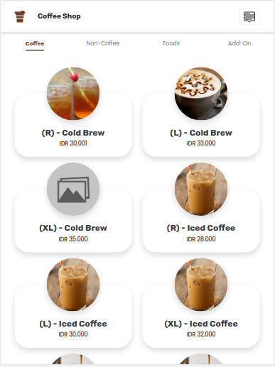
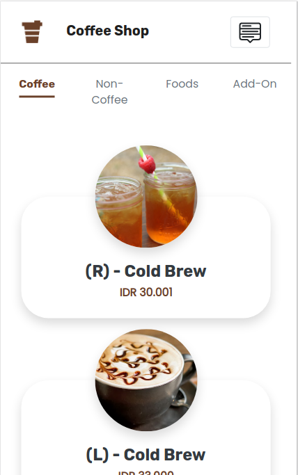

# COFFEE SHOP HARD CORE (FRONTEND)

## About This Project

This is a Point of Sales project for coffee shop. It was build with VUE, VUEX, bootstrap, and etc.

---

## How To Use

1. Clone this repository
2. Clone backend repository and follow the steps
3. Run `npm install`
4. Run backend server `npm run start`
5. Run frontend server `npm run serve`

---

## Features

1. Sign Up
2. Login
3. CRUD
4. Search, sort, pagination
5. Cart
6. History
7. Form Validation
8. OTP

---

## The Interface

Demo on : [Here](http://54.84.168.198:44823/)

#### Desktop

#### Tablet

#### Mobile

## For Backend

You can see at [backend](https://github.com/RZID/Backend-CoffeeShop_HardCode.git)
